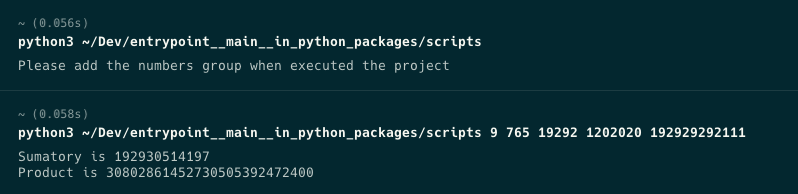

# Usando \__main__ como entrypoint de un proyecto/paquete.

## Introducción

La idea de este repositorio, es mostrar como podemos usar a favor el nombrar un archivo como \__main__.py para ejecutar un proyecto/paquete desde la terminal sin apuntar a un archivo en específico, sino por el contrario, apuntando solo al proyecto/paquete. Es decir, podemos utilizar este archivo para que ejecute toda la lógica del proyecto/paquete. 

Para ello, vamos a construir un proyecto que pueda retornar el resultado de las operaciones matemáticas básicas, dado un arreglo de números de n elementos como argumentos en la terminal.

Este proyecto puede funcionar como paquete público reuniendo una cantidad de requerimientos técnicos más avanzados y así poder alojarlo en [Pypi](https://pypi.org). 

Por obvias razones, este proyecto está diseñado solo para fines demostrativos.

## Componentes

El proyecto consta de una carpeta con 2 archivos super sencillos.

- `maths_operators.py`: Archivo que contiene una clase sencilla con dos métodos que reciben el mismo atributo `numbers`.

- `__main__.py`: Archivo que usa la lógica del archivo anterior, usando exportación de paquetes básica y que ejecuta la lógica después de inicializar la clase.

## Funcionamiento.

- Simplemente debemos ejecutar el proyecto ejecutando:

```python3 -m $PATH/scripts argumentos``` donde $PATH es la ruta previa que te permite llegar hasta donde tienes alojado este proyecto.

A continuación se muestran dos outputs, en el primero no se pasan argumentos, y en el segundo se pasan 5 valores random.



## Documentación Oficial

Si estás interesado en profundizar en este tema te invito a que revises la [documentación oficial](https://docs.python.org/3/library/__main__.html#main-py-in-python-packages)
